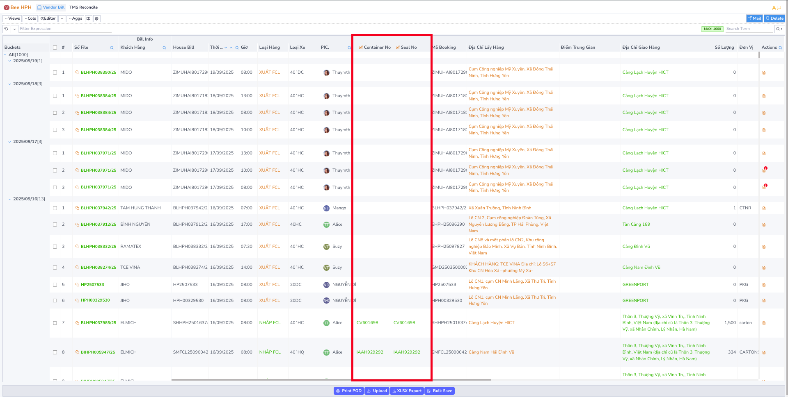
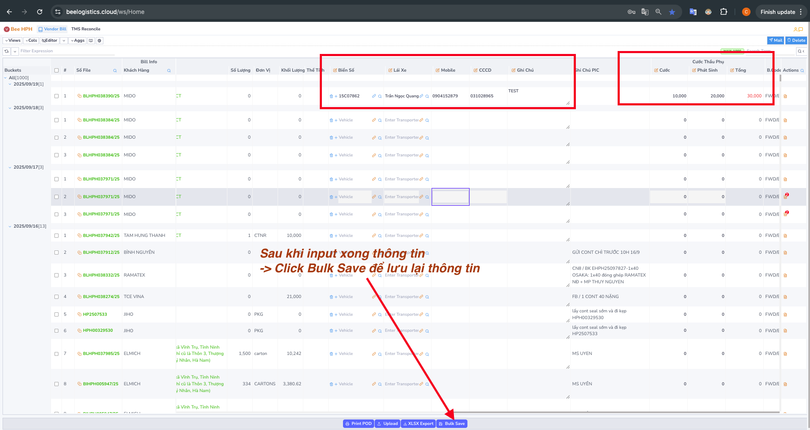
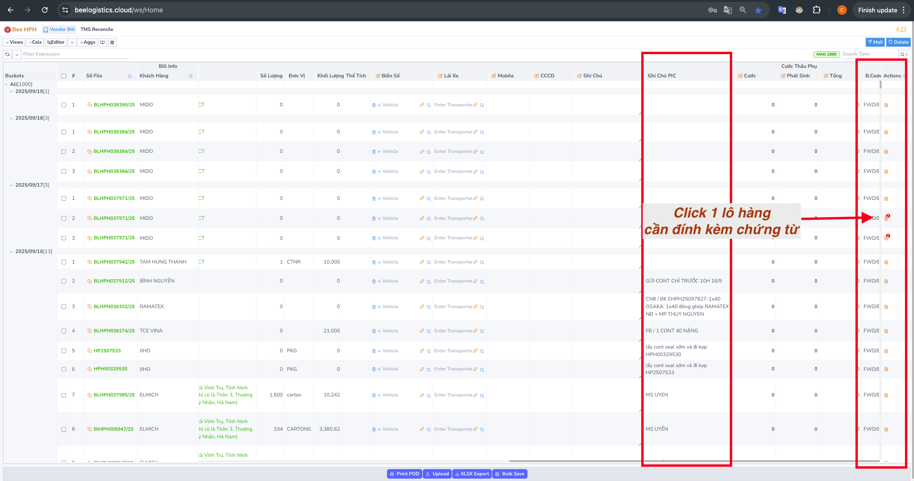
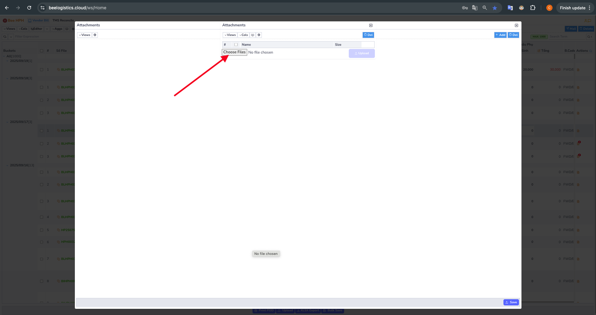
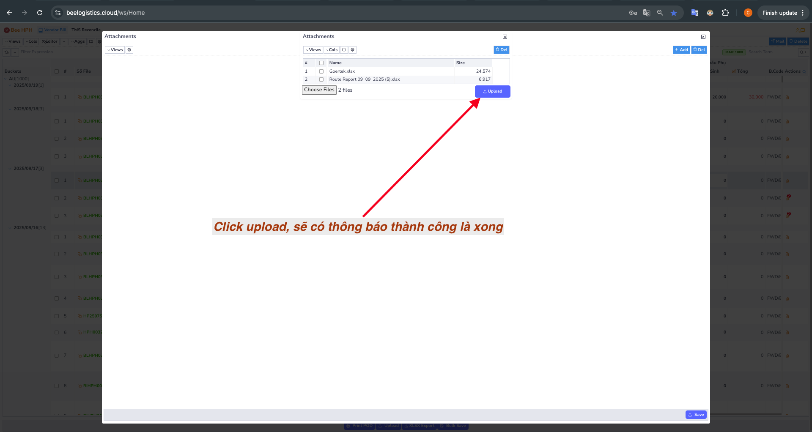
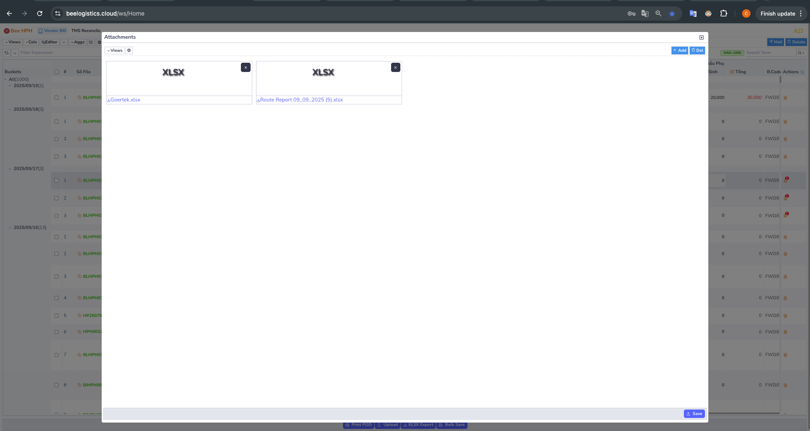

# HƯỚNG DẪN SỬ DỤNG TMS DÀNH CHO THẦU PHỤ

**Lời cảm ơn**

Bee Logistics trân trọng cảm ơn sự hợp tác và đồng hành của Quý Thầu Phụ trong suốt thời gian qua.

Để nâng cao hiệu quả, tính minh bạch và sự chuyên nghiệp trong hoạt động, chúng tôi đã triển khai Hệ thống Quản lý Vận tải(TMS). Hệ thống này giúp tối ưu quy trình làm việc, tiết kiệm thời gian và tăng cường kết nối giữa Bee Logistics và Quý Thầu Phụ.

Tài liệu dưới đây sẽ hướng dẫn sử dụng.

**Các bước thao tác**

# Bước 1: Truy cập hệ thống
* Đường dẫn: https://beelogistics.cloud
* Đăng nhập bằng tài khoản của Bee Logistics cấp.

 

***Video hướng dẫn đăng nhập, đổi mật khẩu, truy cập App quản lý lô hàng cho Thầu Phụ:***

    <iframe
          style={{ position: 'absolute', top: 0, left: 0, width: '100%', height: '100%' }}
          src="https://www.youtube.com/embed/O9tIr56Im5A?si=Rd65vEnvEcOwMwFK"
          frameBorder="0"
          allow="accelerometer; autoplay; clipboard-write; encrypted-media; gyroscope; picture-in-picture"
          allowFullScreen />

 
 
# Bước 2: Theo dõi danh sách vận tải
* Tại màn hình chính, hệ thống sẽ hiển thị danh sách kế hoạch vận tải, sắp xếp theo thứ tự ngày giảm dần.
* Quý Thầu Phụ cần kiểm tra và điền thông tin theo yêu cầu

***Video hướng dẫn tìm kiếm và xuất file Excell:***

    <iframe
          style={{ position: 'absolute', top: 0, left: 0, width: '100%', height: '100%' }}
          src="https://www.youtube.com/embed/kEY6uWA6p8Y?si=VWr6oFdHjMRjbKrA"
          frameBorder="0"
          allow="accelerometer; autoplay; clipboard-write; encrypted-media; gyroscope; picture-in-picture"
          allowFullScreen />

 
 
# Bước 3: Nhập thông tin cần thiết

**a. Thông tin xe**
* Quý Thầu Phụ cung cấp danh sách lái xe, Bee Logistics sẽ hỗ trợ nhập vào hệ thống làm dữ liệu nguồn hỗ trợ input.
* Khi nhập thông tin, QTP chỉ cần điền biển số xe. Các thông tin khác (Tên lái xe, Số điện thoại, CCCD) sẽ tự động hiển thị theo dữ liệu đã lưu.
Trường hợp dữ liệu chưa được cập nhật trong bộ dữ liệu nguồn thì Quý Thầu Phụ có thể tự điền tay.
 

**b. Thông tin cont/seal (Đối với hàng xuất)**
* Điền số container và seal theo thực tế.
 

**c. Cước vận chuyển**
* **Gồm 3 cột chính:**
  * Cước cố định
  * Cước phát sinh
  * Tổng cước(Hệ thống tự động cộng từ 2 cột trên)

 
 * **Save lại thông tin sau khi nhập xong**

***Video hướng nhập số cont, seal; Thông tin xe; Cước, phát sinh:***

    <iframe
          style={{ position: 'absolute', top: 0, left: 0, width: '100%', height: '100%' }}
          src="https://www.youtube.com/embed/w60Y56v4vMI?si=qypzcxnG1gAUJ2yV"
          frameBorder="0"
          allow="accelerometer; autoplay; clipboard-write; encrypted-media; gyroscope; picture-in-picture"
          allowFullScreen />

**d.Ghi chú & chứng từ đính kèm**
* Nhập ghi chú về tình trạng lô hàng hoặc các vấn đề phát sinh (phát sinh cước,..).
* Với lô hàng có chứng từ, chọn Upload để lưu trữ

***1. Tải bộ chứng từ lên hệ thống***

***2. Xóa chứng từ***

***Video hướng chứng từ đính kèm:***

    <iframe
          style={{ position: 'absolute', top: 0, left: 0, width: '100%', height: '100%' }}
          src="https://www.youtube.com/embed/g3kDqKEzwGQ?si=VJ9JxqGir5sk1S0h"
          frameBorder="0"
          allow="accelerometer; autoplay; clipboard-write; encrypted-media; gyroscope; picture-in-picture"
          allowFullScreen />

